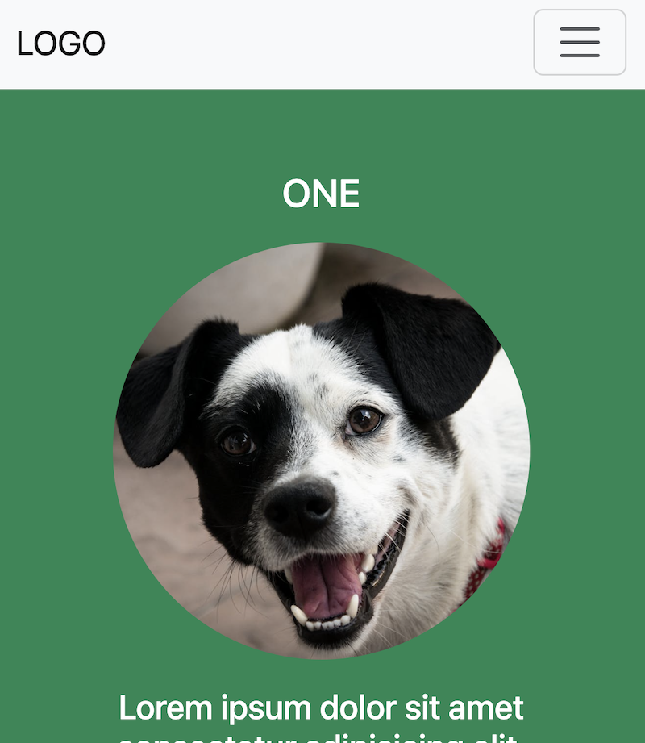
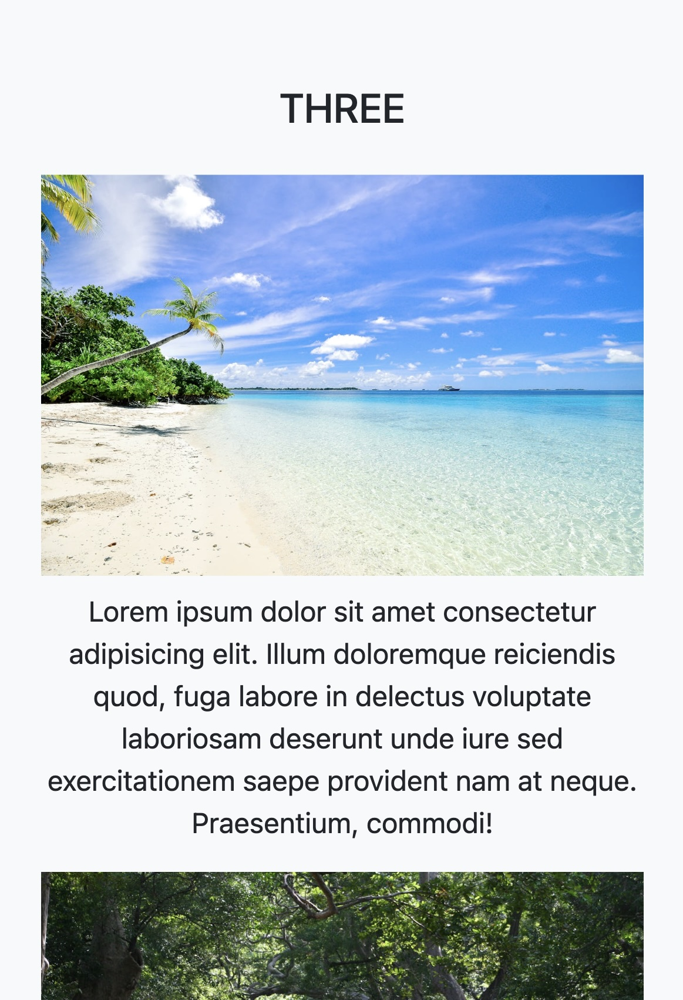

# Live Demo / 公開サイト
  
 [https://chia3blue.github.io/bootstrap-training-1/](https://chia3blue.github.io/bootstrap-training-1/)

## About This Project (English)

This page is a practice site created to understand **Bootstrap 5 components** and the **grid system**, and to learn the fundamentals of **responsive web design**. The design is based on the *“Simple Me”* template from <a href="https://www.w3schools.com" target="_blank" rel="noopener noreferrer">W3Schools</a>, with some custom style adjustments.

**Key technical points include:**

- Layout design using Bootstrap’s grid system  
- Use of the navigation bar  
- Mobile-first responsive design  

This site was built for learning the basics of Bootstrap, so typography, color optimization, and accessibility features have been omitted.

**Note:** The screenshots illustrating these points are provided **after the Japanese explanations** below.

---

## このプロジェクトについて（日本語）

このページは、**Bootstrap 5 のコンポーネントやグリッドシステム**を理解し、**レスポンシブデザインの基礎**を学ぶために制作した練習用サイトです。  
デザインは、<a href="https://www.w3schools.com" target="_blank" rel="noopener noreferrer">W3Schools</a>の「*Simple Me*」テンプレートを参考にしつつ、一部スタイルを調整しています。

**主な技術ポイントは以下の通りです：**

- Bootstrapのグリッドシステムを用いたレイアウト設計  
- ナビゲーションバーの利用  
- モバイルファーストのレスポンシブ対応  

Bootstrapの基本を学習する目的で作成したため、タイポグラフィやカラーの最適化、アクセシビリティ対応は省略しています。

## Screenshots

### Top Page (PC)

### Mobile View

#### 1. Hamburger Menu / ハンバーガーメニュー表示

#### 2. Grid Single Column / スマホ表示でグリッドレイアウトが1列（縦並び）になった様子

